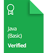

# HackerRank | Practice, Tutorials & Interview Preparation Solutions

This repository consists of solutions to HackerRank **practice**, **tutorials**, and **interview preparation** problems with **Python**, **Linux**, **C++**, and **Java**.

 

 

## Personal HackerRank Profile

[View Profile](https://www.hackerrank.com/maasker)

## HackerRank Badges

## HackerRank Certificates

